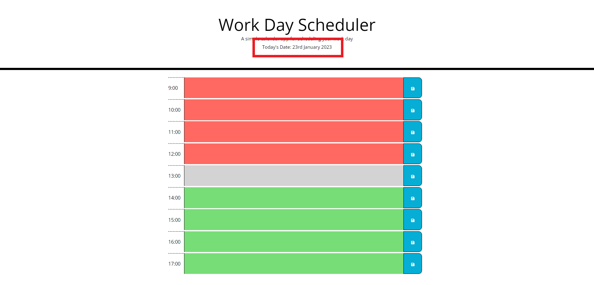
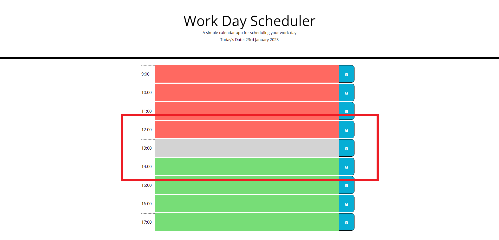
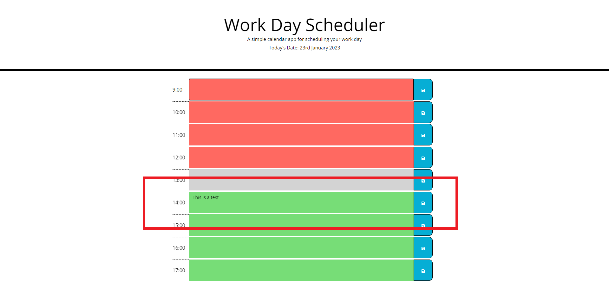

# Busy-bee-work-day-scheduler

## Description

This website allows the user to create a work day planner. The user can type their to-do's into each hour section and save it (to local storage). This input will be saved to the hour even if the page is refreshed.

## Usage

When the page is opened, the date is shown at the top of the page as shown below.

The colour of the row will change based on if the current hour is later than the row (red), the same as the row (grey), or earlier than the row (green). The current time in the image below is 13:00.

When the user inputs into a specifc row, and presses the save button for that row, the input is saved to local storage and the row value stays as the input. This stays even if the page is refreshed.

Deployed site:

## License

MIT